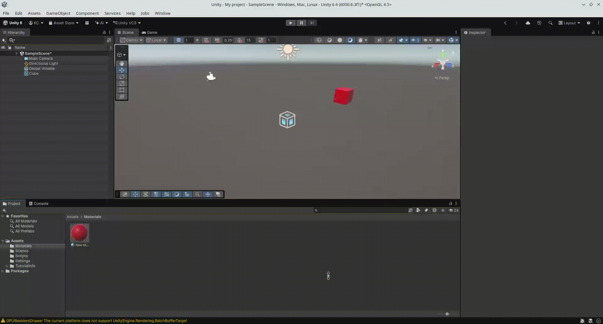
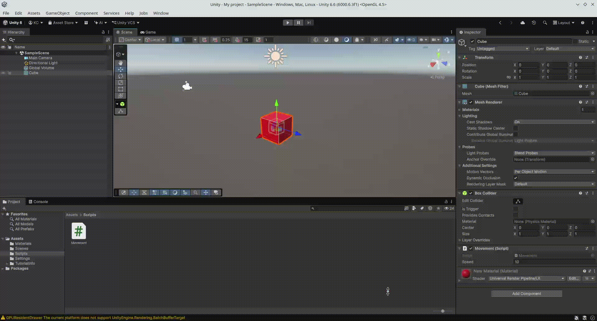

# Práctica 2: Legacy Input Manager

## Ejercicio 5

## Ejercicio 6

## Ejercicio 7

## Ejercicio 8

a) La velocidad del cubo se duplica, ya que el vector tiene el doble de longitud.  
b) Se dubplica la velocidad del cubo, igual que en el ejercicio anterior.  
c) El movimiento sigue ocurriendo en la misma dirección pero de forma más lenta.  
d) El cubo no se cae, se desplaza en la dirección del vector `moveDirection`, ya que no le afecta la gravedad.  
e)
 - Space.World: El cubo se desplaza respecto a los ejes globales de la escena. Aunque el cubo esté rotado, el vector (1, 0, 0) siempre
                lo moverá hacia la derecha absoluta de la escena.  
 - Space.Self: El cubo se desplaza alineado a sus propios ejes locales. Si el cubo está rotado 45° e intento
               moverlo en el eje z, avanzará hacia donde apunte su parte delantera.  

## Ejercicio 9

## Ejercicio 10

<!-- ## Ejercicio 11 -->

<!--  -->
